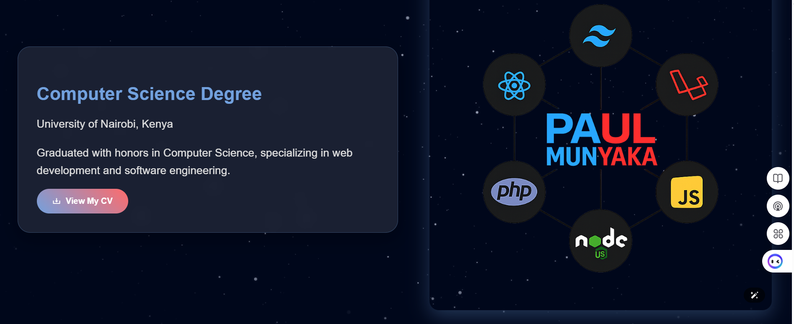

# Paul Munyaka's Animated Portfolio Website #

Welcome to my personal portfolio! This website showcases my skills, projects, education, and interests as a Full Stack Developer. Explore my work, learn about my background, and feel free to get in touch!

**Link**
https://paulmulwa.github.io/PaulM-Portfolio/

## 📂 Table of Contents #

- [About Me](#-about-me)
- [Features](#-features)
- [Screenshots](#-screenshots)
- [Sections](#-sections)
- [Technologies Used](#-technologies-used)
- [Getting Started](#-getting-started)
- [Deployment](#-deployment)
- [Contact](#-contact)
- [License](#-license)

---

## 👋 About Me ##

Hi! I'm **Paul Munyaka**, a passionate Full Stack Developer based in Nairobi, Kenya. I specialize in building dynamic websites, mobile apps, and robust software solutions. I love solving problems, exploring new technologies, and creating seamless user experiences.

---

## ✨ Features ##

- Animated, modern, and responsive design  
- Smooth navigation and section transitions  
- Downloadable CV  
- Interactive project showcase with video previews  
- Contact form with validation  
- Social media integration  
- Mobile-friendly and cross-browser compatible  

---

## 🖼️ Screenshots

### 🔹 Home Page 

### 🔹 CV

### 🔹 Technologies

### 🔹 Programming Languages

### 🔹 CAontact Section

---

## 📑 Sections ##

- **Home:** Hero section with animated background and introduction  
- **About:** Brief bio and personal background  
- **Education:** Academic background and CV download  
- **Interests:** Cards highlighting professional interests with videos  
- **Projects:** Portfolio of selected projects with video demos and links  
- **Skills:** Overview of technical and design skills  
- **Programming Languages:** Grid of languages and frameworks used  
- **Contact:** Contact information, social links, and a working contact form  
- **Footer:** Copyright and quick social links  

---

## 🛠️ Technologies Used ##

- **HTML5**  
- **CSS3** (with custom animations and responsive design)  
- **JavaScript**  
- **Boxicons**  
- **AOS (Animate On Scroll)**  

---

## 🚦 Getting Started ##

1. **Open `index.html` in your browser to view locally.**

2. ## 📬 Contact ##

- **Email:** 
- **Phone:** 
- **Location:* 

3. ## **Socials:** ##
- [GitHub]
- [LinkedIn]
- [YouTube] 
- [Twitter]
- [Instagram]

---

## 📄 License ##

This project is open source and available under the [MIT License](LICENSE).

---

> _Made with ❤️ by Paul Munyaka_
